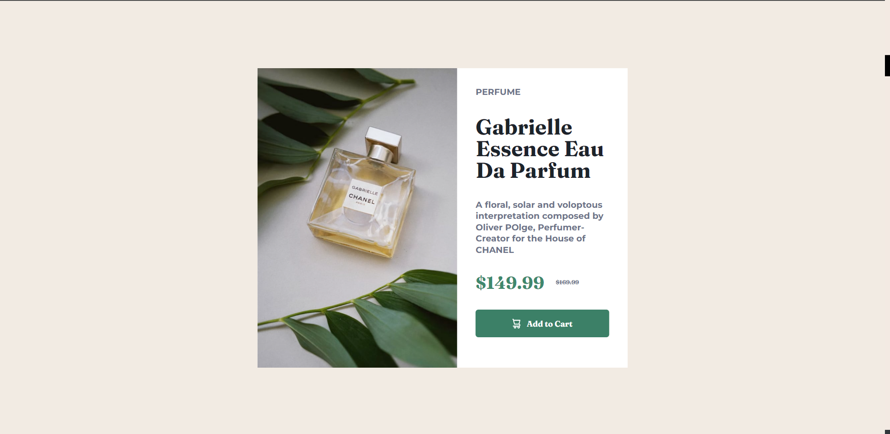

# Frontend Mentor - Product preview card component solution

This is a solution to the [Product preview card component challenge on Frontend Mentor](https://www.frontendmentor.io/challenges/product-preview-card-component-GO7UmttRfa). Frontend Mentor challenges help you improve your coding skills by building realistic projects. 

## Table of contents

- [Overview](#overview)
  - [The challenge](#the-challenge)
  - [Screenshot](#screenshot)
  - [Links](#links)
- [My process](#my-process)
  - [Built with](#built-with)
  - [What I learned](#what-i-learned)
  - [Continued development](#continued-development)
- [Author](#author)

## Overview

### The challenge

Users should be able to:

- View the optimal layout depending on their device's screen size
- See hover and focus states for interactive elements

### Screenshot

### Links

- Solution URL: [Gabrielle Perfume - GITHUB](https://github.com/Samjolas/Gabrielle-Perfume)
- Live Site URL: [Gabrielle Perfume - LIVE](https://samjolas.github.io/Gabrielle-Perfume)

## My process

- Evaluate the design 
- Look through the design with the design to out some measurement with Adobe Photoshop
- Decide on where to use flexbox or grid (I choose flexbox)
- Wrtie my first line of HTML and add Favicon
- Arrange my SASS, link my css to my html and test if my SASS is working well 
- Add all variable style and reset style 
- start coding the webpage 
- check for responsiveness 
- write README

### Built with

- Semantic HTML5 markup
- BEM METHODOLOGY
- CSS (SASS)
- Flexbox
- Responsive Design

### What I learned

- I experimented the use of absolute measurement and reative measurement. 

- At first I use embed for the icon svg but I found out it didn't work, it said something about unsupported plugin, I will look into that after this project 

- MY major challenge is creating a website with the figma design or the actual website. Just using a jpg is really not the best when builidng a website 

### Continued development

- Keep improving my css skills and also my JavaScript skills. 

- Code more often 

## Author

- Frontend Mentor - [@Samjolas](https://www.frontendmentor.io/profile/Samjolas)

